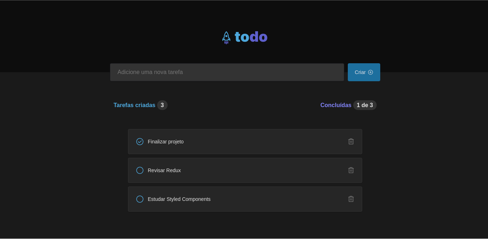

<h1 align="center">
  ToDo
</h1>

  <a href="#rocket-tecnologias">Tecnologias</a>&nbsp;&nbsp;&nbsp;|&nbsp;&nbsp;&nbsp;
  <a href="#-projeto">Projeto</a>&nbsp;&nbsp;&nbsp;|&nbsp;&nbsp;&nbsp;
  <a href="#-execução">Execução</a>

 

  

## 🚀 Tecnologias

Esse projeto foi desenvolvido com as seguintes tecnologias:

- [Node.js](https://nodejs.org/en/)
- [React](https://reactjs.org)
- [Vercel](https://vercel.com)
- [Vite](https://vitejs.dev/)

## 💻 Projeto

O Todo é um projeto que simula um controlador de tarefas, onde se consegue criar, deletar e definir o status das tarefas.

## 🤔 Execução

Você pode utilizar a aplicação por este [link](https://todo-deborafantinif.vercel.app/).
